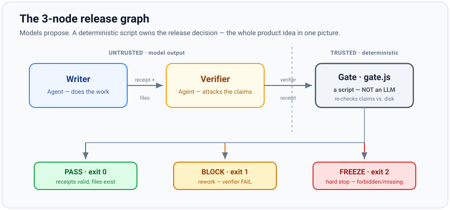

# agent-graph-starter

**Zero → first agent graph.** A beginner course in agent graph engineering,
with a real, runnable 3-node graph as the central example — on Claude Code
**or** the OpenAI Agents SDK, your choice.

## Zero-knowledge start

- **What is this?** A hands-on course plus a working example that teaches
  you how to design a small team of AI agents that work together on a task,
  with a real deterministic checkpoint before anything is called "done."
- **Who is it for?** Someone comfortable running a couple of commands in a
  terminal, who has never built an agent. The **concepts** in lessons 00–16
  need no coding and no AI account — they're reading plus tiny plain scripts.
  Running the real graph (lessons 17–19) does need some command-line comfort;
  this is a first-agent course, not a first-computer course.
- **What will I learn?** Dependency analysis, sequential and parallel
  execution, fan-out/fan-in, routing, controlled cycles, node contracts,
  failure-as-data, artifacts and references, state and recovery,
  verification, deterministic gates, cost/performance tradeoffs, and
  observability — see the full [`curriculum/`](./curriculum/README.md), a
  20-lesson course (00–19).
- **What do I need?** A computer with a terminal and Node.js. To run the real
  graph you also need **either** a Claude Code subscription **or** an OpenAI
  API account — not both. See the [pre-flight checklist](#pre-flight-checklist)
  before you start the clock.
- **How much does it cost?** Nothing to learn the concepts (no AI calls at
  all through lesson 16). One real graph run is two small LLM calls — a
  fraction of a cent to a few cents, or included in a Claude subscription.
  See [`docs/SAFETY.md`](./docs/SAFETY.md#what-one-default-run-actually-costs-order-of-magnitude).
- **Do I need Claude?** No — only if you're taking that path.
- **Do I need OpenAI?** No — only if you're taking that path instead.
- **How long does it take?** The **no-AI gate demo below runs in under a
  minute** and is your first win. A full real run, from a clean checkout with
  the tools already installed, is more like **20–30 minutes** the first time
  once you count installing agents, keys, and reading the receipts — faster
  after that. If a tool is missing it takes longer; the pre-flight checklist
  is there so you find that out before, not during.
- **What will I build?** The graph below, run for real, plus two deliberate
  failures so you understand exactly why each one exists.

**Start the curriculum here:** [`curriculum/00-start-here/`](./curriculum/00-start-here/README.md)

---

## What you will build



<details>
<summary>Same graph as plain text (for screen readers / terminals)</summary>

```text
        ┌─────────────┐
        │   Writer    │  (Agent 1 — does the work)
        └──────┬──────┘
               │  receipt + files
               ▼
        ┌─────────────┐
        │  Verifier   │  (Agent 2 — attacks claims, does not trust Writer)
        └──────┬──────┘
               │  verifier receipt
               ▼
        ┌─────────────┐
        │   Gate.js   │  (deterministic script — NOT an LLM)
        └──────┬──────┘
               │
     PASS ─────┼───── BLOCK ───── FREEZE
   (ok to ship)   (rework)     (hard stop)
```

</details>

**Rule that matters:** only the script decides release. Agents write receipts. They never promote themselves.

---

## Your first win: run the gate now (no AI, no account, under a minute)

Before any keys or installs, you can see the entire product idea run. You only
need Node.js and this repo:

```bash
cd 01-claude-code
node scripts/gate.js runs/demo-pass
node scripts/gate.js runs/demo-freeze
node scripts/gate.js runs/demo-block
```

You should see **PASS**, then **FREEZE**, then **BLOCK** (exit codes 0, 2, 1).
That is the whole product idea in three commands: a plain script — not an LLM —
reading receipts and real files off disk and deciding. See
[`curriculum/14-verification-and-gates/`](./curriculum/14-verification-and-gates/README.md)
for what each outcome means. Everything else in this repo is about *producing*
those receipts honestly.

Want to prove the gate isn't just trusting the receipts? Run the offline test
suite — it makes the gate FREEZE on a receipt that claims a file which isn't
there:

```bash
node tests/gate.test.js     # from the repo root
```

---

## Pre-flight checklist

The gate demo above needs nothing but Node. Running the **real** graph needs
more, and the fastest way to a frustrating first run is discovering a missing
piece halfway through. Get every box green *first*:

**Both paths**

- [ ] `node -v` prints 18 or higher
- [ ] You cloned/downloaded this repo and can `cd` into it

**Claude path** (`01-claude-code/`)

- [ ] [Claude Code](https://code.claude.com) is installed and you're on a paid plan (Pro works — enable Dynamic workflows in `/config` if asked)
- [ ] You can open Claude Code with its working directory set to `01-claude-code/`

**OpenAI path** (`02-openai-agents/`)

- [ ] `python3 --version` prints 3.10+ and you can create a venv
- [ ] You have an OpenAI **API** account with billing enabled (separate from ChatGPT) and an `OPENAI_API_KEY`

Pick **one** path — you do not need both. Details:
[`01-claude-code/PROMPTS.md`](./01-claude-code/PROMPTS.md) or
[`02-openai-agents/README.md`](./02-openai-agents/README.md).

---

## Run the real graph (Claude path)

New to agent graphs? Read [`curriculum/00-start-here/`](./curriculum/00-start-here/README.md)
first — this section is for people who want to see it run before reading why.
(Prefer OpenAI? See [`02-openai-agents/README.md`](./02-openai-agents/README.md) instead — same graph, different platform.)

### 1. Copy agent files into Claude Code

```bash
cd 01-claude-code
mkdir -p .claude/agents
cp agents/writer.md .claude/agents/
cp agents/verifier.md .claude/agents/
```

(Or open Claude Code in this folder and ask it to install the agents from `agents/`.)

### 2. Paste one prompt

Open Claude Code in `01-claude-code/` and paste from [`PROMPTS.md`](01-claude-code/PROMPTS.md) — start with **Prompt A (full graph)**.

### 3. Read the run folder

After the run, open `runs/<your-run-id>/`:

- `writer-receipt.json`
- `verifier-receipt.json`
- `warden-receipt.json` (written by `gate.js`)

Or get a one-line-per-node summary instead of opening each file:

```bash
node scripts/observe.js runs/<your-run-id>
```

If anything doesn't match what `PROMPTS.md` says to expect, see [`docs/TROUBLESHOOTING.md`](./docs/TROUBLESHOOTING.md).

---

## Why this is "graph engineering"

| Piece | In this repo |
|--------|----------------|
| **Node** | Writer, Verifier, Gate |
| **Edge** | handoff / "when Writer finishes → Verifier" / exit codes from Gate |
| **Shared state** | files under `runs/<id>/` |
| **Trust boundary** | Gate is a script; models are untrusted |

Frontier platforms (Claude subagents + workflows, OpenAI Agents SDK) are the **runtime**. The graph is the **design**. Full concept-by-concept breakdown: [`curriculum/`](./curriculum/README.md).

---

## Folder map

| Path | Purpose |
|------|---------|
| `curriculum/` | The beginner course — start here if you haven't already |
| `01-claude-code/` | Claude path — agents, gate script, prompts, demo runs (PASS/BLOCK/FREEZE) |
| `02-openai-agents/` | OpenAI Agents SDK path — real runnable graph, same gate script |
| `tests/` | Offline smoke tests (gate exit codes, hardening, schema) — no API key; run in CI |
| `docs/GLOSSARY.md` | Every term used in this repo, defined once |
| `docs/TROUBLESHOOTING.md` | Common errors and fixes |
| `docs/PLATFORM-COMPARISON.md` | Claude Code vs OpenAI Agents SDK vs Codex, concept by concept |
| `docs/GRAPH-DESIGN-WORKSHEET.md` | 20 questions to work through before building your own graph |
| `docs/WHY.md` | Plain-English nodes, edges, why not one big agent |
| `docs/ROADMAP.md` | Path to 5+ agents + MCP memory bank |
| `docs/SAFETY.md` | Cost numbers, what the gate checks, prompt-injection, permissions |
| `SECURITY.md` | How to report a gate bypass or unsafe-habit concern |
| `docs/VIDEO-SHOT-LIST.md` | 5 short screen-recording clips (commands + captions) if you want to add video |

---

## What next? (product direction, not required tonight)

This starter is intentionally simple: three nodes, no database, no
dashboard, no hosted infrastructure — see [Non-goals](./docs/ROADMAP.md#non-goals).
Once you're comfortable with the graph shape here, the same rules (a script
owns release, agents propose) scale up:

1. Add Planner + Critic + Release Warden (5 nodes).
2. Attach an **MCP memory bank** so runs share durable facts across sessions.
3. Swap the toy task for your real domain (security gate, content pipeline, etc.).

See [`docs/ROADMAP.md`](docs/ROADMAP.md).

---

## License

MIT — use it, fork it, teach with it.
